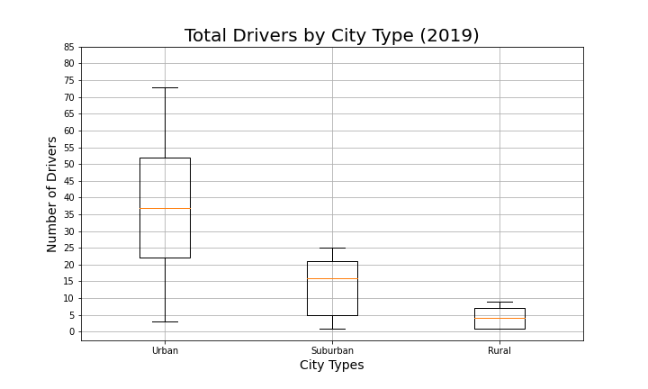
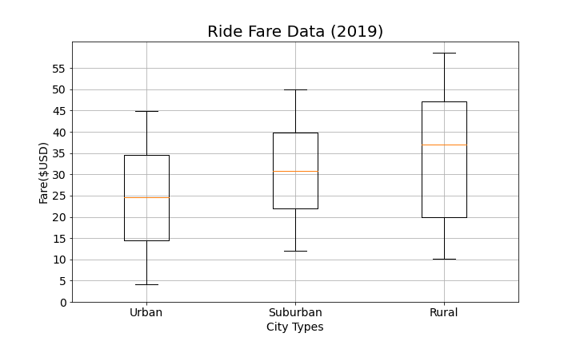
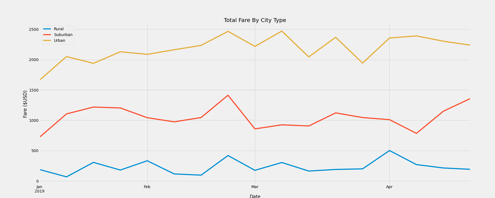

# PyBer Analysis

## Purpose of Analysis:

We are tasked to create a summary DataFrame of the ride-sharing data by city type by using Python and Pandas skills. Then, using Pandas and Matplotlib, create a multiple-line graph that shows the total weekly fares for each city type. Finally, the goal is to show how the data differs by city type and how those differences can be used by decision-makers at PyBer.

## Results:

Based on the scatter graph on _Figure 1_ , the number of rides in Urban cities are higher which cuases the chiper fare. On the other hand there are Rural cities which are provided with less number of rides which has led to more expensive fares amount. For Suburban cities we have the number of rides and fare price in between. 

*Figure 1:* Ride-sharing data among the different city types

*Figure 2:* Total rides per city type

*Figure 3:* Total drivers per city type

*Figure 4:* Total fares per city type

## Summary:

*Figure 5:*

### Suggested Solutions:
- Between February to March the Fare price for all city types gone up so a good approach to tackle this issue is to define a base fare for each erea which prevent the flactuation in fare rates.
- The number of rides and drivers have direct impact on the fare price, so having more rides meaning hiring more drives which can reduces the fare price and help to attract more people and increase the income. 
